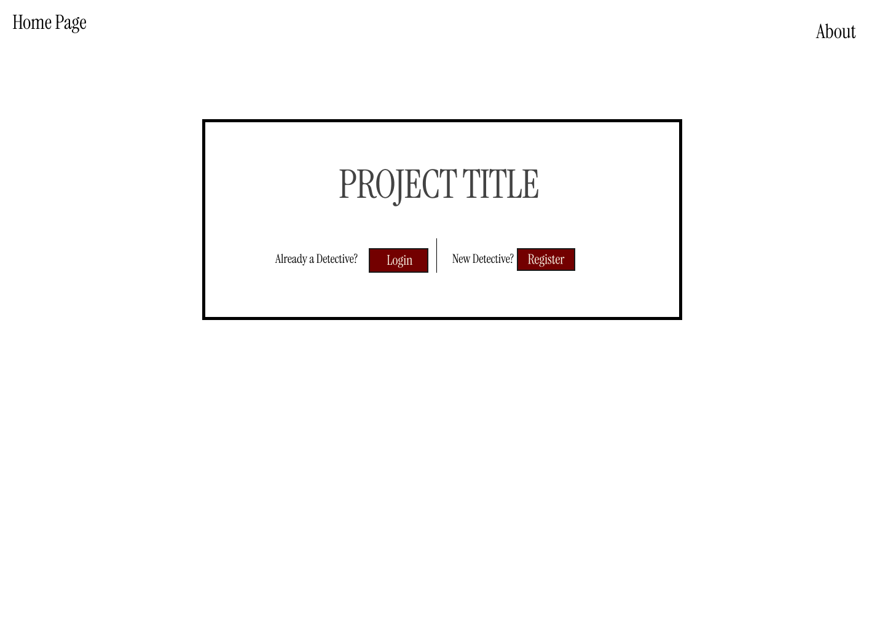
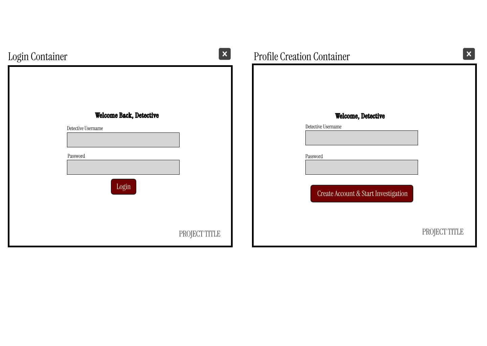

# M1: Proposal and API design

---
## Problem and users
Fans of mystery and puzzle games rarely get interactive web games experience where they can investigate clues, interrogate suspects, and analyze real museum artwork to solve a murder. Most online web mystery games may feel static, predictable or disconnected from real-world data. Players want a more immersive experience where evidence, suspects, and alibis can be cross-checked against real museum information. 

This app is for puzzle enthusiasts, escape-room fans, and casual gamers who enjoy detective-style games and challenges. It also appeals to art lovers who want a unique way to explore real artwork and galleries from the Art Institute of Chicago. Users can browse artwork, collect evidence, track clues, evaluate suspects’ alibis, and potentially solve a murder using data they collect.

---
## MVP Features
1. New users can create a new account with their detective name and password. 
2. A signed-in user can explore different gallery locations in the museum by selecting from a list of live gallery data from the Art Institute of Chicago.
3. A signed-in user can perform interactive forensic search actions (such as searching for prints, passwords, or checking for scents) to reveal clues that are hidden in the art’s metadata.
4. A signed-in user can save clues or text in their Detective Notebook.
5. A signed-in user can view, edit, or delete the contents of their Detective Notebook.
6. A signed-in user can submit a final accusation by selecting the person they believe is guilty on the accusation card, this will allow users to stop the investigation once they think they found the murderer.
---
## Future Features
1. Users can receive a score based on how quickly they solve the case and the suspect they chose
2. A signed-in user can view a list of suspects and compare their alibis and motives.
3. Users can have the choice to replay completed cases and choose a different suspect.
4. Users can explore alternate endings.


---
## External API
* **API Name:** Art Institue of Chicago API
* **Documentation:**  https://api.artic.edu/api/v1
* **Authentication Requirements:** None
* **Rate Limit:** 60 requests per minute
* **Feature Using the API Example:** The gallery exploration and artwork investigation features use the Art Institute of Chicago API to retrieve real gallery and artwork information. The artwork information is used as part of the investigation and to connect custom clues to specific artwork.
* **Example Response:** 
```json
{
  "data": {
    "id": 2147478068,
    "title": "Gallery 272",
    "is_closed": false,
    "number": "272",
    "floor": "2"
  }
}
```

---
## Data model draft
The User resource will store the information for each detective account that was created. It will include an id as an integer, a detectiveUsername as a string, and a password as a string. All three fields will be required.

The Clue resource will store the different clues found by the players during their investigation. It will include an id as an integer, a title as a string, a description as a string, a type as a string and an artworkId as an integer. All of these three fields will also be required. The artworkId will be used to connect the clue to an artwork from the Art Institute of Chicago API.

The Notebook Entry resource will store notes and clues saved by users. It will include an id as an integer, a userId as an integer, a clueId as an integer, a text as a string, and a createdAt as a date. The id, userId, createdAt and text fields will be required while clueId can be optional as users can write a note that is not connected to a specific clue. 


---
## Endpoint list

## External Endpoint List
| Method | Path | Function | Success Status Code | Error Status Codes |
|--------|------|----------|---------------------|--------------------|
| GET | /api/artwork/:id | Retrieves data belonging to a specific artwork from the Art Institute of Chicago API | 200 | 404, 502 , 504 |
| GET | /api/galleries | Retrieves gallery locations from the Art Institute of Chicago API | 200 | 502 , 504 |

## Clue Endpoint List
| Method | Path | Function | Success Status Code | Error Status Codes |
|--------|------|----------|---------------------|--------------------|
| GET | /api/clues | Retrieves all clues | 200 | 401, 500 |
| GET | /api/clues/:id | Retrieves a specific clue  | 200 | 401, 404, 500 |
| PUT | /api/clues/:id | Updates an existing clue | 200 | 400, 401, 404, 500 |
| POST | /api/clues | Creates a new custom clue  | 201 | 400,401,500 |
| DELETE | /api/clues/:id | Deletes a clue | 204 | 401,404,500 |

## Notebook Endpoint List
| Method | Path | Function | Success Status Code | Error Status Codes |
|--------|------|----------|---------------------|--------------------|
| GET | /api/notebook | Retrieves entries from the signed-in user's notebook | 200 | 401, 500 |
| GET | /api/notebook/:id | Retrieves a specific notebook entry | 200 | 401, 404, 500 |
| POST | /api/notebook | Creates a new notebook entry | 201 | 400, 401, 500 |
| PUT | /api/notebook/:id | Updates the contents of an existing notebook entry | 200 | 400, 401, 404, 500 |
| DELETE | /api/notebook/:id | Deletes a notebook entry | 204 | 401, 404, 500 |

---
## Wireframes
### Home Page



### Login / Signup



### Detective Notebook - Entry


### Detective Notebook - Add Entry


### Accusation Card


### Clue Details Card


### Gallery Map


--
## Team roles
- Eton Miller: API Development and Database Management Lead
- Melissa Paredes: Frontend & UI/UX Lead
- Stanley Nguyen: Repo & Pull Requests Lead
